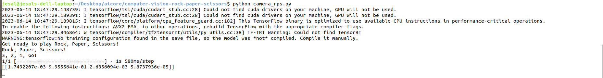
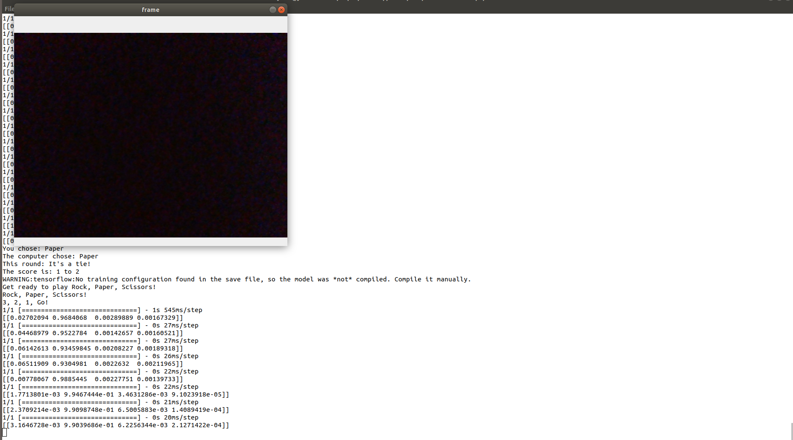
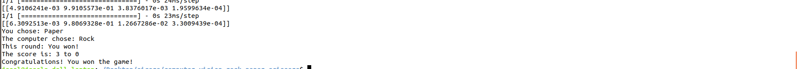

Rock, paper, scissors is a classic game played between two people to settle disputes or simply for fun. The players simultaneously display one of three hand gestures: rock, paper, or scissors. Rock beats scissors by crushing it, scissors beat paper by cutting it, and paper beats rock by covering it.

In this implementation of the game, I introduce an interactive twist where the user can play against the computer by making hand gestures in front of their camera.

This game could be improved by training over a more diverse set of images. To improve user experience a countdown could be added to the webcam display or sounds could be added after each round indicating if they won or lost. 


- [Creating the Computer Vision System](#creating-the-computer-vision-system)
- [Creating a Rock Paper Scissors Game](#creating-a-rock-paper-scissors-game)
	- [get\_computer\_choice()](#get_computer_choice)
	- [get\_user\_choice()](#get_user_choice)
	- [get\_winner(computer\_choice, user\_choice)](#get_winnercomputer_choice-user_choice)
	- [play()](#play)
- [Using the camera to play Rock Paper Scissors](#using-the-camera-to-play-rock-paper-scissors)
	- [get\_prediction()](#get_prediction)
	- [New play()](#new-play)
- [How To Run](#how-to-run)
	- [Getting Started](#getting-started)
		- [Clone the Repository](#clone-the-repository)
	- [Example Gameplay](#example-gameplay)

# Creating the Computer Vision System

To create the computer vision model for this game, I leveraged the power of [Teachable-Machine](https://teachablemachine.withgoogle.com). The following steps were taken to develop the model:

1) Training Data: I uploaded images representing four classes: rock, paper, scissors, and nothing. These images showcase different hand gestures for each option.
2) Model Creation: Using the Teachable Machine interface, I trained a model based on the provided images. This model is used to recognise and classify hand gestures accurately.
3) Model Output: After the training process, the model was downloaded from the "Tensorflow" tab. The resulting model is named keras_model.h5 and the corresponding text file containing the labels is named labels.txt.


# Creating a Rock Paper Scissors Game

The `manual_rps.py` file simulates a rock, paper and scissors game by using typed input from the user. Four functions were used to create the game simulation. 

## get_computer_choice()
The `get_computer_choice()` function randomly selects between "rock", "paper" and "scissors" and returns the computer's choice as a string. It uses the `random.choice()` function to pick a random element from the given list of choices.

## get_user_choice()
The `get_user_choice()` function asks the user to input their choice. The user's choice is then converted into lowercase for consistency. The user's choice is returned as a string.

## get_winner(computer_choice, user_choice)
The `get_winner(computer_choice, user_choice)` function takes two arguments, `get_computer_choice()` and `get_user_choice()`. The computer and user choice is compared and the winner following the game logic is decided. If the user wins "You won!" is printed and if the user loses "You lost" is printed. When the user and the computer have made the same choice "It is a tie!" is printed. If none of these conditions is met then there is an error with the user input and a message saying "Invalid choice! Please choose Rock, Paper, or Scissors." is printed. 

## play()

The `play()` function simulates the game by calling the necessary functions. It gets the computer's choice, prompts the user for their choice, and determines the winner based on the choices. The result is then printed.

# Using the camera to play Rock Paper Scissors

The `camera_rps.py` file builds from computer vision model and the manual rock paper scissors game to simulate a rock, paper and scissors game by using webcam input from the user. This enhances the user experience by making the game more interactive. To do this the previously described `play()` function was modified and a new function `get_prediction()` is introduced. 

## get_prediction()
The `get_prediction()` function loads the computer vision model created in the previous section [Creating the Computer Vision System](#creating-the-computer-vision-system). The model is loaded using the Keras library. 

To capture the user's hand gesture, the function initialises the webcam capture using OpenCV (cv2). Each frame captured is also resized to match a defined frame size and normalised for prediction. The processed frame is then fed into the model and the gesture with the highest prediction confidence is selected as the user's choice. The corresponding choice (Rock, Paper, Scissors, Nothing) is returned as a string.

## New play()

The `play()` function is responsible for executing a multiple-round game of Rock Paper Scissors between the player and the computer. It initiates the round, keeps track of the scores and determines the final winner at the end of the game. The function uses a while loop to allow multiple rounds of the game to be played. This loop breaks when either the player or the computer reaches a score of 3. A score update is also displayed for the user to keep track of the score between rounds. 

# How To Run

To run the game on your local machine follow these steps:

## Getting Started

### Clone the Repository

1. Open your terminal or command prompt.
2. Navigate to the directory where you want to clone the repository.
3. Run the following command to clone the repository:

   ```bash
	git clone https://github.com/your-username/rock-paper-scissors.git

Replace 'your-username' with your GitHub username.

### Install Dependencies

Ensure you have Python installed on your machine. Navigate to the cloned repository's directory and stall the required Python dependencies using pip:

   ```bash
	pip install requirements.txt
   ```	
This will install the necessary packages specified in the requirements.txt file.

## Run the Game

1. Ensure your webcam is connected to your machine.
2. Run the following command to execute the game from the project directory:
   ``` bash
	python camera_rps.py
   ```

## Example Gameplay
Here are some screenshots showing gameplay:

This displays what you see when you start the game. 


During the gameplay, a real-time webcam feed will be displayed in a frame. Using hand gestures indicate your choice of rock, paper, or scissors by positioning your hand accordingly within the frame to make your selection. Make sure you show your choice promptly; this frame will disappear after 3 seconds.


When either you or the computer reach 3 wins the game ends. The following screenshot is an example of the game end.



